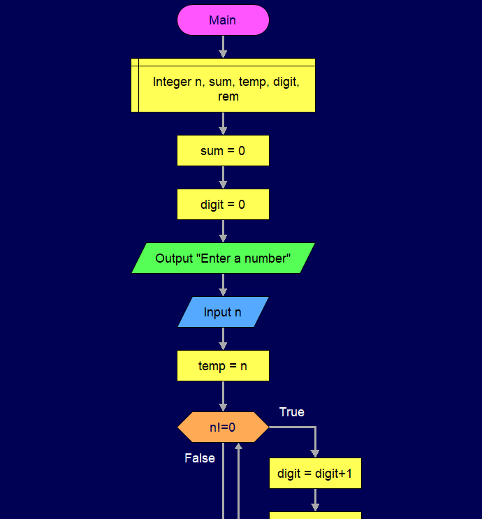
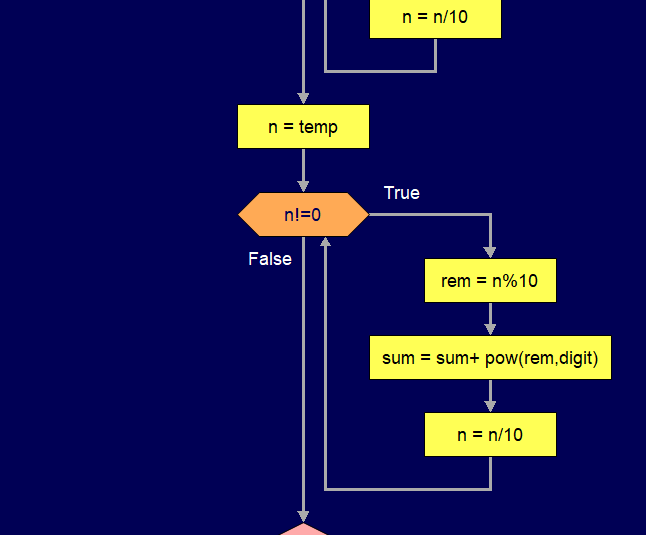
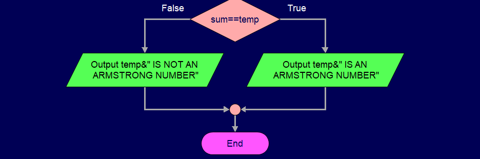
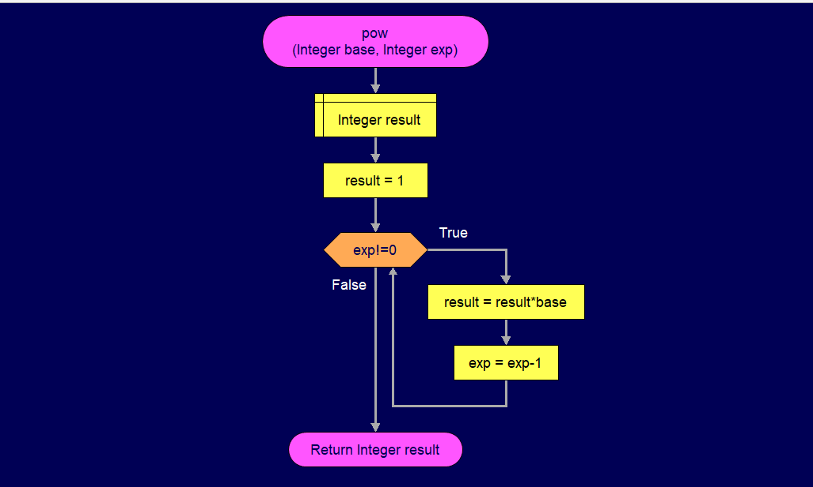

# **ARMSTRONG NUMBER**
---
### *What is an armstrong number?*
> A number  *a*  is an Armstrong Number or narcissistic number if it is equal to the sum of its own digits raised to the power of the number of digits.

>  a=(a1)^n + (a2)^n +....+ (an)^n

> where *a* is number of *n* digits

---
### <span style="color:red"> **Pseudocode** </span>

```
Main function:
BEGIN
INITIALISE sum=0 and digit=0
INPUT number n
ASSIGN value of n to temp
WHILE n is not equal to 0
   add 1 to digit
   SET n = n/10
ENDWHILE
SET n=temp
WHILE n is not equal to 0
   SET rem = n%10
   SET sum = sum + pow(rem,digit)
   SET n = n/10
ENDWHILE
IF sum==temp
   OUTPUT The number n is an armstrong number
ELSE 
   OUTPUT The number n is not an armstrong number
ENDIF
END

pow function:
BEGIN
SET result = 1
WHILE exponent exp is not equal to 0
SET result = result*base
subtract 1 from exponent exp
ENDWHILE 
END
```
---

### <span style="color:red"> **Flowchart** </span>
MAIN FUCTION:





POWER FUNCTION:

